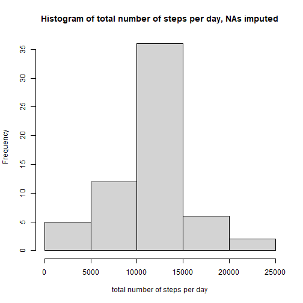

### load & prepare data

```r
activity <- read.csv("./activity.csv")
lapply(activity, class)
```

```
## $steps
## [1] "integer"
## 
## $date
## [1] "character"
## 
## $interval
## [1] "integer"
```

```r
activity$steps <- as.numeric(activity$steps)
activity$interval <- as.numeric(activity$interval)
activity$date <- as.Date(activity$date)
lapply(activity, class)
```

```
## $steps
## [1] "numeric"
## 
## $date
## [1] "Date"
## 
## $interval
## [1] "numeric"
```


## What is the mean total number of steps taken per day?


```r
steps_per_day <- aggregate(steps~date, activity, sum)
hist(steps_per_day$steps, xlab="total number of steps per day", main="Histogram of total number of steps per day")
```


```r
mean_steps <- mean(steps_per_day$steps) 
median_steps <- median(steps_per_day$steps)
```

Mean total number of steps per day: 1.0766189 &times; 10<sup>4</sup>  
Median total number of steps per day: 1.0765 &times; 10<sup>4</sup>  


## What is the average daily activity pattern?


```r
daily_activity <- aggregate(steps~interval, activity, mean)
plot(daily_activity$interval, daily_activity$steps, xlab="interval", ylab="steps", main="Average steps per interval", type="l")
```


```r
max_interval <- daily_activity$interval[daily_activity$steps==max(daily_activity$steps)]
```
Number of interval with highest average of steps: 835


## Imputing missing values

```r
n_missings <- sum(is.na(activity$steps))
```
There are 2304 NAs in the dataset.

NA will be substituted by the mean value of steps for that interval:

```r
activity2 <- activity
rows_missings <- as.list(which(is.na(activity2$steps)))
for(i in rows_missings) {
        dummy <- activity2$interval[i]
        activity2$steps[i] <- daily_activity$steps[daily_activity$interval==dummy]
}
steps_per_day2 <- aggregate(steps~date, activity2, sum)
hist(steps_per_day2$steps, xlab="total number of steps per day", main="Histogram of total number of steps per day, NAs imputed")
```



```r
mean_steps2 <- mean(steps_per_day2$steps) 
median_steps2 <- median(steps_per_day2$steps)
```

Mean total number of steps per day: 1.0766189 &times; 10<sup>4</sup>  
Median total number of steps per day: 1.0766189 &times; 10<sup>4</sup>   
There is a small difference in the median but no difference in the mean. Imputing data this way does have small effects but on such a big scale, imputed values spread quite evenly across the real values.

## Are there differences in activity patterns between weekdays and weekends?

```r
activity2$weekend <- "weekday"
activity2$weekend[weekdays(activity2$date)=="Samstag" | weekdays(activity2$date)=="Sonntag"] <- "weekend"
steps_per_weekday <- aggregate(steps~interval+weekend, activity2, mean)

library(lattice)
xyplot(steps ~ interval | weekend,
       data = steps_per_weekday,
       type = "l")
```


